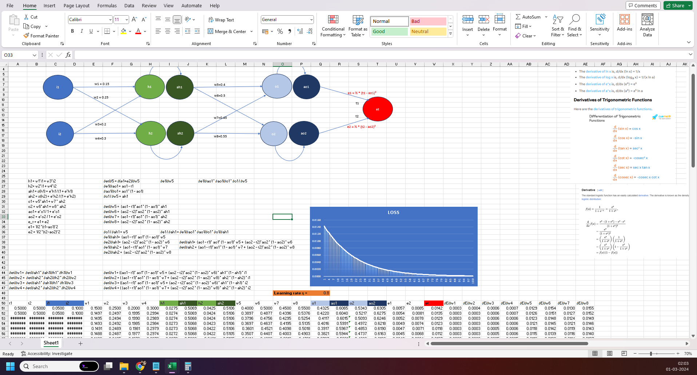
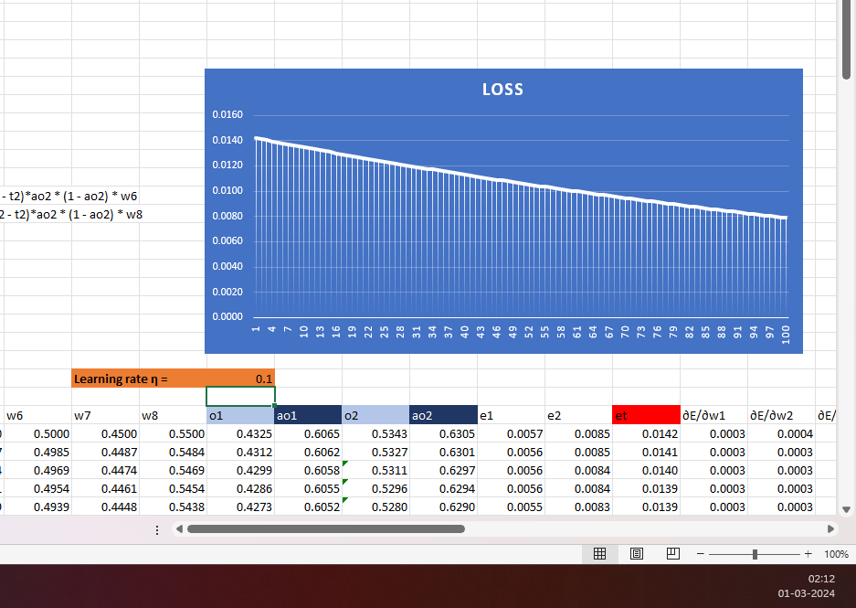
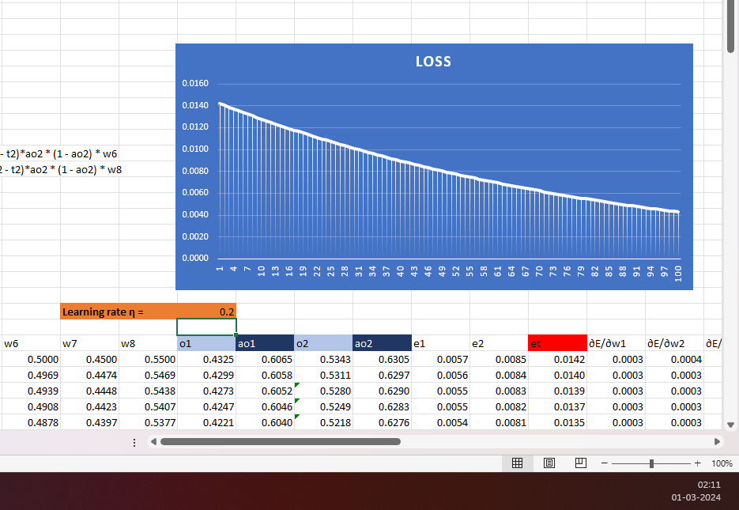
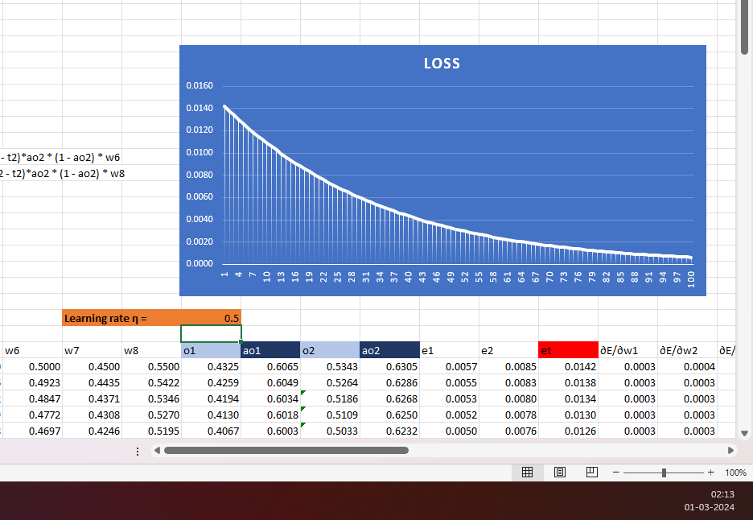
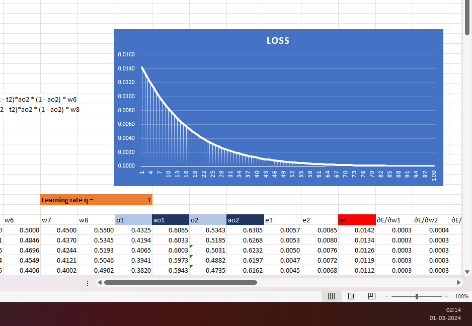
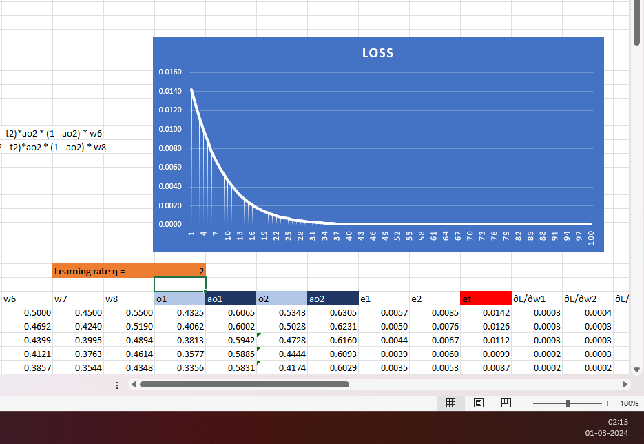

# Assignment - 6

## PART-1 Showing back propagation  

Completed excel sheet with formula was created. See following screenshot as reference

### Major steps in calculating impact on weight with respect to loss

1. We need to calculate the partial derivative of loss with respect to each weight
2. Some of the derivatives are know like derivative of sigmoid function
3. Based on known values of derivative we calculated the equation for partial derivative of each weight w.r.t. total-loss 

Screen shot for different learning rates are shown below

Learning rate: 0.1

Learning rate: 0.2

Learning rate: 0.5

Learning rate: 0.8

Learning rate: 1.0

Learning rate: 2.0

## PART-2 Showing back propagation  

Not able to reach accuracy of 99.4%. Max achieved is 98.73 %
Tried different dropout mechanisim like:

1. Constant drop out in all conv layers 
2. Increasing drop out i n Conv layer
3. Network remain same with parameters count = 19978 (320+64+9248+64+9248+64+528+272+170)
4. Added batch normalization in every conv layer except max pooling
5. Tried with different batch size, drop out rate . Best suited was 256 ad 0.08 respectively. 